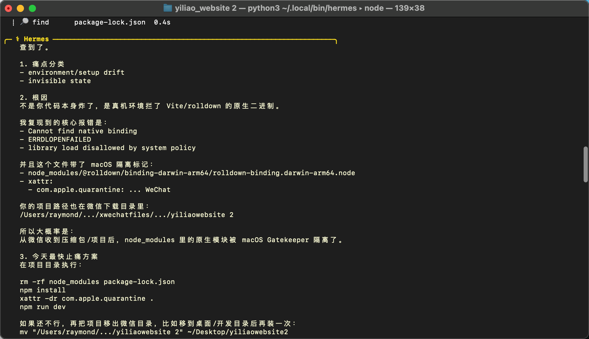
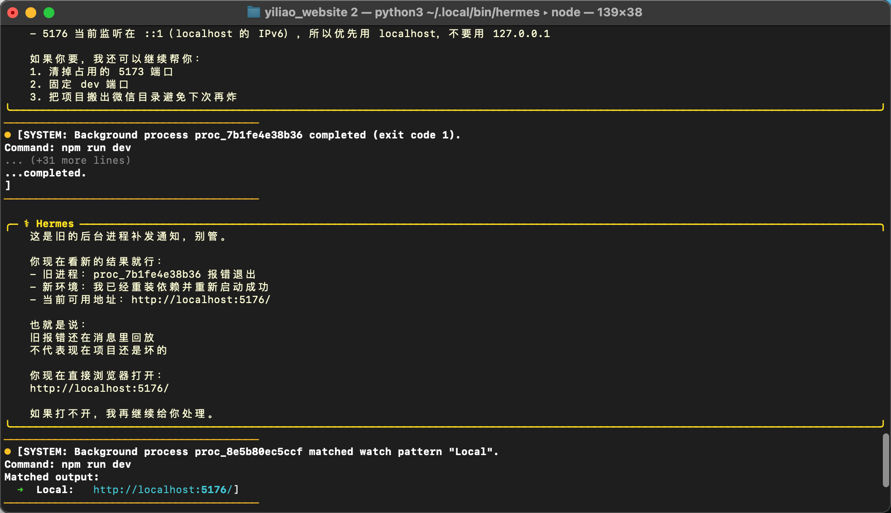
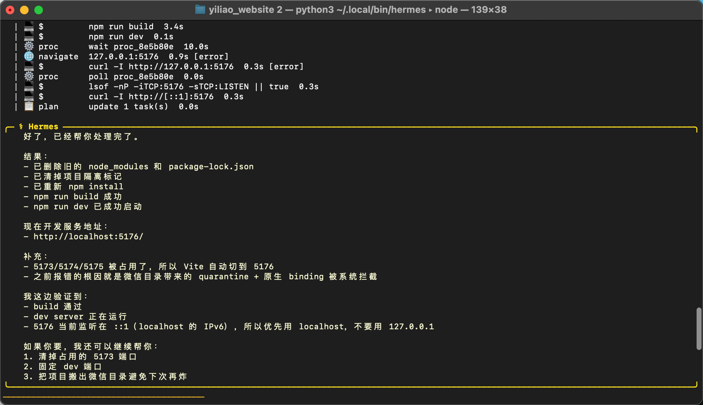

# 截图说明

这三张截图展示了这个 Skill 在真实 Hermes 调试流程里的使用效果。

## 1. 根因诊断

这张图展示了 Skill 如何把模糊的 `npm run dev` 报错收敛成明确结论：macOS 的 quarantine 隔离标记拦住了从微信目录拿到的项目中 `rolldown` 原生 binding。

## 2. 区分旧失败进程与新成功进程

这张图展示了 Hermes 如何把旧后台进程的失败通知和当前新的健康状态分开，避免用户被历史报错误导。

## 3. 修复完成并可运行

这张图展示了最终结果：依赖已重装、隔离标记已移除、build 通过、dev server 成功跑在 `http://localhost:5176/`。

